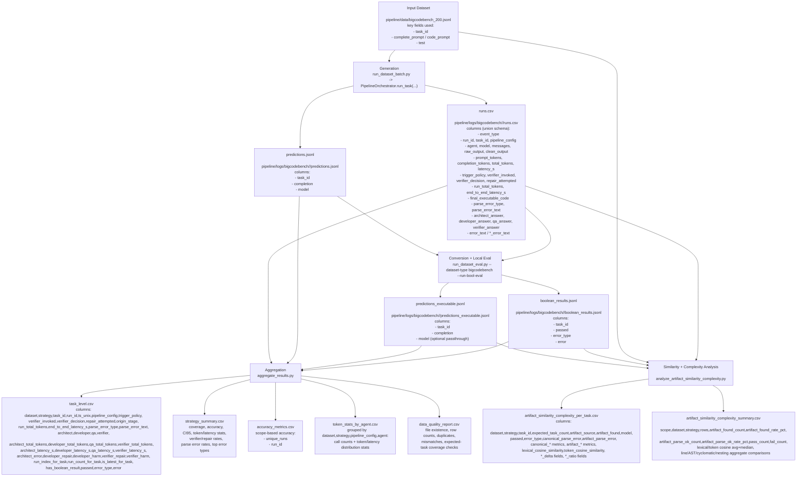

# Complete Workflow Diagram (BigCodeBench)

This diagram shows the full pipeline from generation to evaluation to aggregation to similarity/complexity analysis, using real column names from BigCodeBench artifacts.

## End-to-End Flow

## BigCodeBench Artifact Headers (Current)

These are the actual current headers from your files.

### `predictions.jsonl` (row object keys)

- `task_id`
- `completion`
- `model`

### `predictions_executable.jsonl` (row object keys)

- `task_id`
- `completion`
- `model`

### `boolean_results.jsonl` (row object keys)

- `task_id`
- `passed`
- `error_type`
- `error`

### `runs.csv` header

- `event_type,ts_unix,run_id,task_id,pipeline_config,agent,model,messages,raw_output,clean_output,prompt_tokens,completion_tokens,total_tokens,latency_s,error_text,trigger_policy,verifier_invoked,verifier_decision,repair_attempted,final_correct,origin_stage,run_total_tokens,end_to_end_latency_s,final_executable_code,parse_error_type,parse_error_text,config,prompt,prompt_hash,architect,developer,qa,verifier,final_answer,architect_prompt_tokens,architect_completion_tokens,architect_total_tokens,architect_latency_s,developer_prompt_tokens,developer_completion_tokens,developer_total_tokens,developer_latency_s,qa_prompt_tokens,qa_completion_tokens,qa_total_tokens,qa_latency_s,verifier_prompt_tokens,verifier_completion_tokens,verifier_total_tokens,verifier_latency_s,architect_answer,developer_answer,qa_answer,verifier_answer,architect_error_text,developer_error_text,qa_error_text,verifier_error_text,correct_answer,architect_error,developer_repair,developer_harm,verifier_repair,verifier_harm`

## Script Mapping

- Generation/orchestration:
  - [run_dataset_batch.py](/c:/VScode/pipeline/run_dataset_batch.py)
  - [orchestrator.py](/c:/VScode/pipeline/orchestrator.py)
- Conversion/eval:
  - [run_dataset_eval.py](/c:/VScode/pipeline/run_dataset_eval.py)
- Aggregation:
  - [aggregate_results.py](/c:/VScode/pipeline/aggregate_results.py)
- Similarity/complexity:
  - [analyze_artifact_similarity_complexity.py](/c:/VScode/pipeline/analyze_artifact_similarity_complexity.py)
